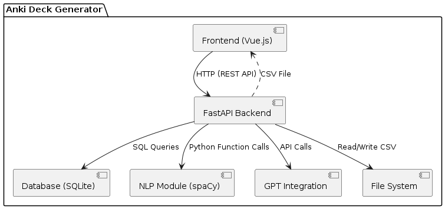
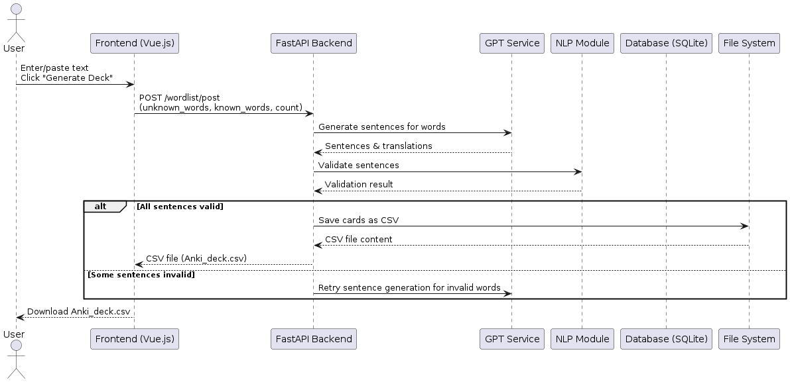
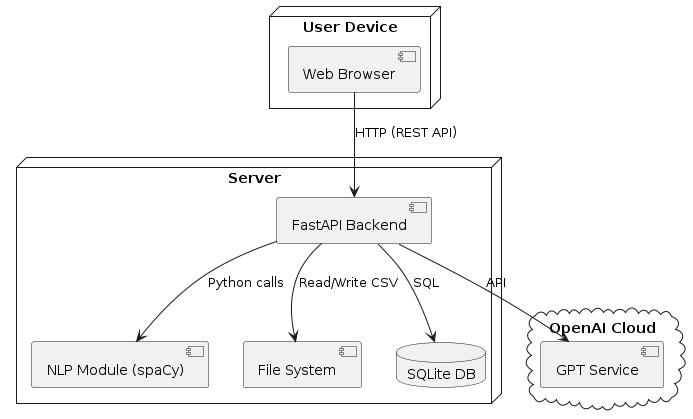

## Development 
### Kanban board
link to the Kanban board: https://github.com/orgs/AnkiGen/projects/2/views/1
| Column            | Entry Criteria |
|-------------------|----------------|
| To Do         | - Issue is created with a clear description<br>- Priority and estimation are added<br>- Follows the issue template<br>- Linked to a Milestone|
| In Progress   | - Branch created <br>- Assignee is set<br>|
| Ready to Deploy | - MR is approved<br>- No merge conflicts<br>- All review feedback is addressed |
| Done          | - User feedback is received<br>- Critical bugs are fixed (or split into new issues)<br>- Documentation updated (if needed) |

### Build and deployment
  #### Continuous Integration
      Link to CI: https://github.com/AnkiGen/anki_deck/blob/master/.github/workflows/main.yml
      List of tools:
        - ubuntu
        - unittest
        - pytest
      CI workflows runs: https://github.com/AnkiGen/anki_deck/blob/backend/test_results.txt
### How to launch using docker
```
Step 1. Install docker desktop on your computer
Step 2. open terminal from directory
Step 3. create in the same directory .env with OPENAI_API_KEY=TOKEN and replace TOKEN with your GPT token
Step 4. Log in docker using command "docker login" in terminal (you shall create account before and log in in docker desktop application)
Step 5. in terminal run command: "docker pull dkddjdjjfjdj/anki-deck"
Step 6. launch any vpn. It won't work without it because OpenAi restricted access to Russia 
Step 7. then in terminal run command: "docker run --env-file .env -p 8000:8000 dkddjdjjfjdj/anki-deck"
Step 8. in browser open application by going on this link: "localhost:8000/anki_deck/"
Link to the Docker Hub: "https://hub.docker.com/repository/docker/dkddjdjjfjdj/anki-deck/general"
```


### Git workflow
In our project we adapted base GitHub flow
1. Creating issues: we use several templates for the issues (https://github.com/AnkiGen/anki_deck/tree/templates/.github/ISSUE_TEMPLATE). The most commonly used are User Story, Issue and Bug report
2. Rules for creating issues: every change starts with an issue and must include: Priority (P0-P3), Estimation (Story Points), Milestone
3. Labelling Issues
- type: bug|feature|chore
- priority: P0-P3
3. Branching strategy
- naming convention
- creation
4. Commit messages
- format: use conventional commits
5. Pull requests
- Use PR Template
6. Code Reviews
- reviewers: assign 1-2 team members (not the author)
- feedback rules: be specific
7. Merging PRs
- who merges: author (after approval) or maintainer
- post-merge: delete the branch, update the issue status (e.g., "Done" in "somewhere")
8. Resolving Issues
- rlosed automatically when PR is merged (via Closes #123)
- reopen if bugs are found post-merge
### Git workflow using Gitgraph diagram

### Secrets management
To protect sensitive data (API keys, passwords, tokens), we follow:
1. Storage
- Environment Variables: Stored in GitHub Secrets (for CI/CD).
- Local Development: Use .env files (added to .gitignore).
- Production: Managed via AWS Parameter Store (or equivalent).
2. Rules
- Never Commit Secrets: Scan commits with git-secrets or truffleHog. Use placeholders (e.g., API_KEY=your_key_here in docs).
- Rotation: Secrets are rotated quarterly or after team changes.
- Access Control: Only maintainers and CI/CD systems have access.

## Architecture
### Static view
  

Our codebase is organized into clear modules: API, database, NLP processing, and frontend. The API layer interacts with the database and NLP modules via well-defined interfaces, minimizing coupling. Each module is responsible for a single concern, increasing cohesion. This modularity improves the maintainability of the product, as changes in one module (e.g., NLP logic) have minimal impact on others.
### Dynamic view
  

A user submits a text to generate an Anki deck. The frontend sends the text to the FastAPI backend, which processes the text, interacts with the NLP module to extract words, queries the database for known/unknown words, and finally returns a downloadable deck. In our production environment, this scenario takes approximately 8 seconds to execute end-to-end
### Deployment view
  

The system is deployed as follows:
Frontend: Runs in the user's browser, served via a static web server. Backend: FastAPI application running selfhosted (Dockerized for portability). Database:file with data stored in the user`s memory. NLP/ML Models: Packaged with the backend, can be containerized for scalability. This setup allows easy deployment on the customer’s side. 
