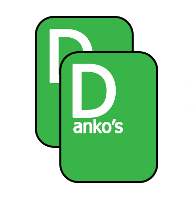

<!-- Improved compatibility of back to top link: See: https://github.com/othneildrew/Best-README-Template/pull/73 -->
<a id="readme-top"></a>
<!--
*** Thanks for checking out the Best-README-Template. If you have a suggestion
*** that would make this better, please fork the repo and create a pull request
*** or simply open an issue with the tag "enhancement".
*** Don't forget to give the project a star!
*** Thanks again! Now go create something AMAZING! :D
-->


<!-- PROJECT SHIELDS -->
<!--
*** I'm using markdown "reference style" links for readability.
*** Reference links are enclosed in brackets [ ] instead of parentheses ( ).
*** See the bottom of this document for the declaration of the reference variables
*** for contributors-url, forks-url, etc. This is an optional, concise syntax you may use.
*** https://www.markdownguide.org/basic-syntax/#reference-style-links
-->
[![Contributors][contributors-shield]][contributors-url]
[![Forks][forks-shield]][forks-url]
[![Stargazers][stars-shield]][stars-url]
[![Issues][issues-shield]][issues-url]
[![Unlicense License][license-shield]][license-url]


<!-- PROJECT LOGO -->
<br />
<div align="center">
  <a href="https://github.com/othneildrew/Best-README-Template">
    
  </a>

  <h3 align="center">DANIL DANKO'S<br> Anki Deck Generator</h3>

  <p align="center">
    What if you could learn a new language with Anki cards—using your favorite songs or book passages, in the easy and creative way?<br/><br>
    <a href="https://github.com/AnkiGen/anki_deck/deployments/github-pages"><strong>Check it out!</strong></a>
  </p>
</div>


<!-- TABLE OF CONTENTS -->
<details>
  <summary>Table of Contents</summary>
  <ol>
    <li>
      <a href="#about-the-project">About The Project</a>
      <ul>
        <li><a href="#built-with">Built With</a></li>
      </ul>
    </li>
    <li>
      <a href="#getting-started">Getting Started</a>
      <ul>
        <li><a href="#prerequisites">Prerequisites</a></li>
        <li><a href="#installation">Installation</a></li>
      </ul>
    </li>
    <li><a href="#usage">Usage</a></li>
    <li><a href="#roadmap">Roadmap</a></li>
    <li><a href="#contributing">Contributing</a></li>
    <li><a href="#license">License</a></li>
    <li><a href="#contact">Contact</a></li>
  </ol>
</details>


<!-- ABOUT THE PROJECT -->
## About The Project

Whether you're a language enthusiast, a curious learner, or a developer exploring NLP-powered tools,  **DANIL DANKO's Anki Deck Generator**  helps you learn languages in context—sentence by sentence. 

With our project you can turn your *favorite songs* or *books* into **personalized Anki flashcards.** 


### Built With
* [![Vue][Vue.js]][Vue-url]  
* [![Python][Python.com]][Python-url] 
* [![OpenAI][OpenAI.com]][OpenAI-url]  
* [![spaCy][spaCy.com]][spaCy-url]  
* [![FastAPI][FastAPI.com]][FastAPI-url]  
* [![Node.js][Node.js.com]][Node.js-url]

<!-- GETTING STARTED -->
## Getting Started

You can run our project in these ways:
### 1. Use the Deployed Web Version
The easiest way!
Just access this [link.](https://github.com/AnkiGen/anki_deck/deployments/github-pages)

### 2. Run with Docker (Recommended)
#### Prerequisites
* docker
* git

#### Installation

1. Clone our repository: ```git clone https://github.com/AnkiGen/anki_deck```
2. Get into the directory: ```cd anki_deck```
3.  Create ``.env`` with ``OPENAI_API_KEY=TOKEN`` and replace ``TOKEN`` with your GPT token.
4. ```docker pull dkddjdjjfjdj/anki-deck```
5. ```docker run --env-file .env -p 8000:8000 dkddjdjjfjdj/anki-deck```

### 3. Run Locally with Node.js (Dev. Mode)
#### Prerequisites
* npm
* node.js
#### Installation
1. Clone our repository: ```git clone https://github.com/AnkiGen/anki_deck.git```
2. Get into the directory: ```cd anki_deck```
3. Install all dependencies: ```npm install```
4. Start the app: ```npm run dev```

Link to the Docker Hub: [Click me!](https://hub.docker.com/repository/docker/dkddjdjjfjdj/anki-deck/general)


<!-- USAGE EXAMPLES -->
## Usage

*In the very beggining...*
You have the opportunity to choose the way of creating an Anki deck!
1) Create deck using the most common and must-known words in English (Great for beginners!)
2) Create deck using the text from your book or song.
(Good for learners who know the basics and want to move further!)

If you go with the **first choice**, the deck is automatically generated and you are welcome to download the deck in ```.csv``` or ```.apkg``` format

If you choose the **second choice**, you need to submit the text in raw format.
Then proceed to *filters*, choose maximal count of words in text and the amount of unknown words in deck.
Then you have these ways of choosing words into the deck:
1) Tinder
2) Manual
3) Word List
Let us go by each of these:
#### Tinder
Very simple to use, mobile, but does not let you control every word in the proposed text. 
- Swipe to the **left** to mark the word as don't want to learn (won't be added to deck)
- Swipe to the **right** to make the word as want to learn (will be added to deck)
- Click on the **top-right** to mark the word as already known.
#### Manual 
Somewhat complex, but yet, very powerful way of choosing words for the deck.
You are presented with the whole text you've submitted.
- By **one-time clicking** the word, you mark it green as want to learn
- By **double clicking** the word, you mark it as read as don't want to learn
- By **clicking thrice** you unmark the word
#### Word List
Presents list of multiple word cards!
Same as in manual:
- By **one-time clicking** the card, you mark it green as want to learn
- By **double clicking** the card, you mark it as read as don't want to learn
- By **clicking thrice** you unmark the card

After finishing choosing words, you are presented to the preliminary view of your generated Anki deck card. You could manually change the word translation and context if needed. 
Also, there is a possibility to **copy** the table in ```.csv``` format for manual change.
When everything is done, you can proceed further for the download in ```.csv``` or ```.apkg``` formats!
<!-- ROADMAP -->
## Roadmap

- [ ] Multi-language Support
    - [ ] German
 - [ ] Improved deck generation logic
 
 See all our tasks [here](https://github.com/orgs/AnkiGen/projects/3)


<!-- CONTRIBUTING -->
## Contributing

Any contributions you make are **greatly appreciated**!

If you have a suggestion that would make this better, please fork the repo and create a pull request. You can also simply open an issue with the tag "enhancement".
Don't forget to give the project a **star**! 

1. Fork the Project
2. Create your Feature Branch (`git checkout -b feature/AmazingFeature`)
3. Commit your Changes (`git commit -m 'Add some AmazingFeature'`)
4. Push to the Branch (`git push origin feature/AmazingFeature`)
5. Open a Pull Request

### Top contributors:

<a href="https://github.com/AnkiGen/anki_deck/graphs/contributors">
  
</a>


<!-- LICENSE -->
## License

Distributed under the MIT License. See `LICENSE.txt` for more information.


<!-- CONTACT -->
## Contact

Ivan K. – telegram: @vanyaspapayas
Viktor K. – telegram: @vitec_321
...


<!-- MARKDOWN LINKS & IMAGES -->
<!-- https://www.markdownguide.org/basic-syntax/#reference-style-links -->
[contributors-shield]: https://img.shields.io/github/contributors/othneildrew/Best-README-Template.svg?style=for-the-badge
[contributors-url]: https://github.com/othneildrew/Best-README-Template/graphs/contributors
[forks-shield]: https://img.shields.io/github/forks/othneildrew/Best-README-Template.svg?style=for-the-badge
[forks-url]: https://github.com/othneildrew/Best-README-Template/network/members
[stars-shield]: https://img.shields.io/github/stars/othneildrew/Best-README-Template.svg?style=for-the-badge
[stars-url]: https://github.com/othneildrew/Best-README-Template/stargazers
[issues-shield]: https://img.shields.io/github/issues/othneildrew/Best-README-Template.svg?style=for-the-badge
[issues-url]: https://github.com/othneildrew/Best-README-Template/issues
[license-shield]: https://img.shields.io/github/license/othneildrew/Best-README-Template.svg?style=for-the-badge
[license-url]: https://github.com/othneildrew/Best-README-Template/blob/master/LICENSE.txt
[product-screenshot]: images/screenshot.png
[Vue.js]: https://img.shields.io/badge/Vue.js-35495E?style=for-the-badge&logo=vuedotjs&logoColor=4FC08D
[Vue-url]: https://vuejs.org/
[Python.com]: https://img.shields.io/badge/Python-3670A0?style=for-the-badge&logo=python&logoColor=ffdd54
[Python-url]: https://www.python.org/

[OpenAI.com]: https://img.shields.io/badge/OpenAI-412991?style=for-the-badge&logo=openai&logoColor=white
[OpenAI-url]: https://openai.com/

[spaCy.com]: https://img.shields.io/badge/spaCy-09A3D5?style=for-the-badge&logo=spacy&logoColor=white
[spaCy-url]: https://spacy.io/

[FastAPI.com]: https://img.shields.io/badge/FastAPI-005571?style=for-the-badge&logo=fastapi&logoColor=white
[FastAPI-url]: https://fastapi.tiangolo.com/

[Node.js.com]: https://img.shields.io/badge/Node.js-339933?style=for-the-badge&logo=nodedotjs&logoColor=white
[Node.js-url]: https://nodejs.org/
